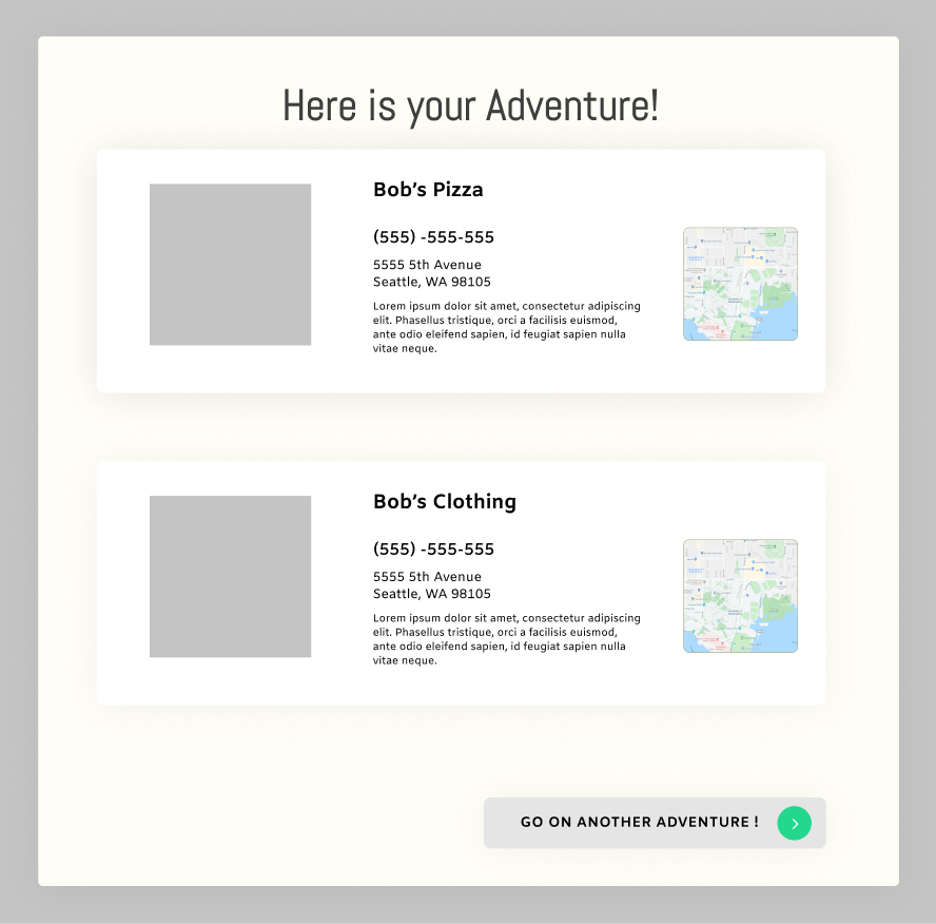

# Problem

Coronavirus (COVID-19) is one of the world's worst pandemics. While much about this virus is unknown, it is continuing to spread rapidly. The widespread outbreak has forced many countries to employ mass quarantines and international travel bans. In particular, social distancing has been used as a common means to slow the transmission. As a result, many individuals have been stuck at home unable to explore their cities. In particular, as students return to campus they are unsure of the activities and businesses that exist in their proximity.  Additionally, social distancing has not only affected our mental and physical health, but has also caused a global economic strain - specifically towards small-medium enterprises (SME). In the United States during the first three months of the pandemic, the number of active business owners dropped by 3.3 million or over 22%. This was the largest ever drop recorded, and its impact was felt across almost all industries. African-American businesses experience the harshest drop with 41% drop in business activity, while Latinx dropped by 32%, and Asian businesses dropped by 26%. (Fairlie, 2020). At restaurants, social distancing means little to no tables therefore we are not able to socialize. 
 
Businesses around the world are beginning to feel early impacts such as loss in sales and supply-chain disruptions, causing many to go out of business. Small businesses are facing a financial crisis as the aftermath of COVID-19 unfolds.With public reactions towards the virus along with government policies for social distancing, it is causing a slump in sales and forcing many businesses to close temporarily. Many SMEs are facing financial stress from being unable to pay employees’ salaries, rent, and loan payment (Bouey, 2020).
 
With the unpredictable nature of the COVID-19 crisis, business owners enter a time of uncertainty as they transition from physical stores to virtual environments. However, local businesses that lack the expenses and expertise in creating an online presence suffer from the consequence of having to shut down their stores indefinitely. Without an outlet for revenue, business owners are forced to lay off many employees, contributing to the overall rise of unemployment rates. Whether they are local restaurants that can’t afford to keep their employees or community operations that rely on physical contribution to run, these local businesses are struggling tremendously to stay afloat during this trying time. With the prediction of a permanent loss of 15,000 local retail stores and depletion of 15 million jobs by the summer, this pandemic is causing permanent damage to local communities (Huddleston, 2020). 

# Existing Solutions

Currently, there are a variety of solutions aimed at trying to gather support for local businesses. One such movement, called AshevilleStrong, urges people to buy gift cards in Asheville to support the local businesses (#AshevilleStrong, 2020). Another campaign website, Support Local Or Else, aims to create a network where people can engage local businesses remotely in Charlotte, NC and Raleigh & Durham, NC. Business owners can submit their business online to the website, where it generates a list of all the businesses gathered in one place. Users can more conveniently view the deals provided by each business (SupportLocalOrElse, 2020). However, both of these solutions only target specific cities in the United States, and the Seattle area has yet to see a similar campaign. 
 
Meanwhile, Groupon has long been providing advertising services for local businesses. The application allows users to see nearby deals from local businesses, view currently valid coupons, and filter searches by location, category, and more. Although Groupon provides a solution for the current problem faced by many local businesses, it collects a large portion of earnings, 50% per sale, from the businesses (Brown, 2020). During these times when money is hard to earn, Groupon may not be a feasible choice for small businesses that are already struggling financially. 
 
The Seattle Medium incorporates a business director which categorizes local businesses and includes a brief description as well as location and operating hours of the business. This website is very informational and is used to help increase traffic for local businesses. However, the website itself is extremely hard to navigate and the businesses offered on this website are rather limited. Additionally, a major plus of this website is how they categorize businesses based on their “genre”. This allows users to better navigate through and find what they are looking for; whether they may be finding a massage parlor or a yummy restaurant to indulge at. 

# Our Solution

While there are a variety of solutions that provide support to local businesses, none of these existing solutions motivate individuals and students to do so. We believe technology can be used to bridge this currently expanding gap between local businesses and consumers. Our solution aims to raise awareness to SMEs by connecting those living nearby to them. Ultimately, we would like to create a website where these businesses can promote themselves to those living nearby in a fun and interactive way. 
 
Our solution will recommend local businesses based on what someone is interested in and how much time they have to spare. An “activity generator” which recommends nearby local businesses. Our solution will accommodate many types of local businesses, such as retail stores, restaurants, beauty services, and more. Additionally, the solution will not take any percentage of the earnings made from the businesses, but simply serve as a platform to connect individuals with new stores around them. This platform can be used by students to discover new places as well as provide a new way to plan hangouts and dates. In the future, as the presence of our service grows, we hope to spread our platform both domestically and internationally. 
 
The platform will be beneficial to both businesses and consumers. It will allow local businesses to grow an online presence, and it would provide local consumers an avenue to explore local businesses near them. Altruism is immensely motivating, simply because of how satisfying it can be. According to the National Center for Biotechnical Information, altruistic behaviour actually engages brain regions associated with reward processing (Filkowski et al., 2016 ). As such, being able to support their favourite local businesses will be uplifting for consumers at this time not only because it will bring the community together, but also because it would be inherently rewarding. 
 
We aim to start the service locally, based in the University District, so that we can utilize the sense of community and local pride to persuade consumers, specifically students, to support their local businesses. We hope that our service will help local SMEs stay competitive and thus financially empower their owners so that they are less vulnerable to the economic impacts of the pandemic. 

# Design and Interaction Description

To create a fun and dynamic environment, users will be led to a landing page which depicts the site as an “adventure” generator. The branding will use fun graphics of cityscapes, mountains, and maps to further add appeal to our platform. The landing page will utilize a nav bar at the top of the screen with a logo in the top left corner and page selections of “Adventure” (the current home/landing page) and “About Us”. The green arrow button will lead users to start the activity generator. 

First, users will be prompted to select how much time they will have to complete an activity. Each time frame will correspond to a specific number of activities that are based on approximate estimates an activity takes to complete (shown in the table below). 

Users must select a time range in order for the next arrow button to become functional. This is a necessary step as it decides how many categories the user can pick afterwards. If they try to click the arrow prematurely, a “please select a time frame” message will pop up. Once they have done so, the time range will become highlighted and they can click the next arrow.

From here, users will be able to select a “category” of the type of activity they are interested in. These categories will include: eat, shop, play, beauty, read, and exercise. Each category will have a simple graphic above it which clearly conveys the types of businesses that are recommended. For example, a coat hanger for “shop.”

If a user had selected a time frame which allows for more than one category selection, they will be prompted to select another category before being able to move forward.  

From here a loading screen will be displayed as the site randomly matches a local business to each category selection.  The loading pages creates a sense of generation of an activity plan that is personalized for the user. 

The last screen will showcase an “adventure” catered to the user’s previous selections (time frame and category). Each activity card will display the local businesses name, website, phone number, and a google maps embed next to an image of their logo. From here users can share the adventure (stretch goal), return to the home page, or generate another adventure. 

**Works Cited**

#AshevilleStrong. (2020). Retrieved April 22, 2020, from https://www.ashevillestrong.com/

Bouey, J. (2020, March 10). Assessment of COVID-19’s Impact on Small and Medium-Size Enterprises. Rand Corporation, Retrieved April 22, 2020 from https://www.rand.org/content/dam/rand/pubs/testimonies/CT500/CT524/RAND_CT524.pdf

Brown, K. (2020, April 1). How to Advertise on Groupon in 2019: The Ultimate Guide. Retrieved April 22, 2020, from https://fitsmallbusiness.com/how-to-advertise-on-groupon/

Fairlie, R. W. (2020, September). The impact of covid-19 on small business owners: The first three months after social-distancing restrictions. IZA. Retrieved October 11, 2021, from https://www.iza.org/publications/dp/13707/the-impact-of-covid-19-on-small-business-owners-the-first-three-months-after-social-distancing-restrictions.

Filkowski, Megan M, et al. “Altruistic Behavior: Mapping Responses in the Brain.” Neuroscience and Neuroeconomics, U.S. National Library of Medicine, 2016, www.ncbi.nlm.nih.gov/pmc/articles/PMC5456281/.

Huddleston, Tom. (2020, March 23). “How Small Business Owners Are Coping with COVID-19 Pandemic: 'It Was My Civic Duty to Be a Part of the Solution'.” CNBC, Retrieved April 22, 2020, from www.cnbc.com/2020/03/23/how-small-businesses-across-us-are-coping-with-covid-19-pandem	c.html.

Korosec, K. (2020, March 16). Uber Eats waives delivery fees for independent restaurants during COVID-19 pandemic. TechCrunch. Retrieved April 22, 2020, from https://techcrunch.com/2020/03/16/uber-eats-waives-delivery-fees-for-independent-restaurants-during-covid-19-pandemic/

SupportLocalOrElse. (2020). Retrieved April 22, 2020, from https://www.supportlocalorelse.com/

