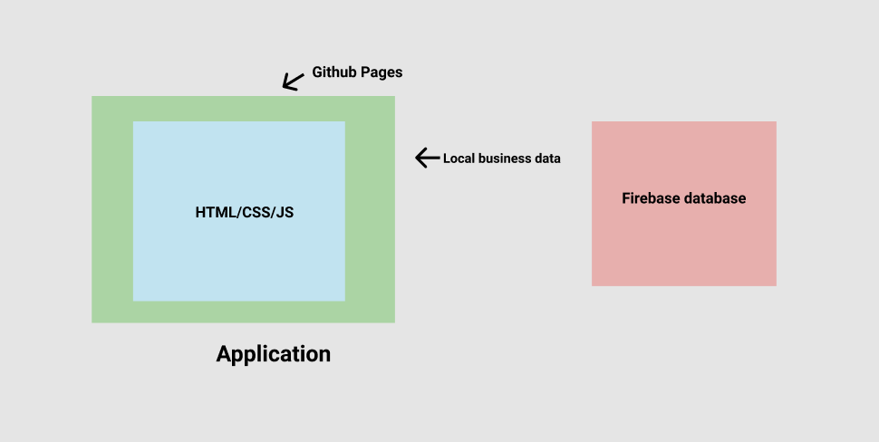
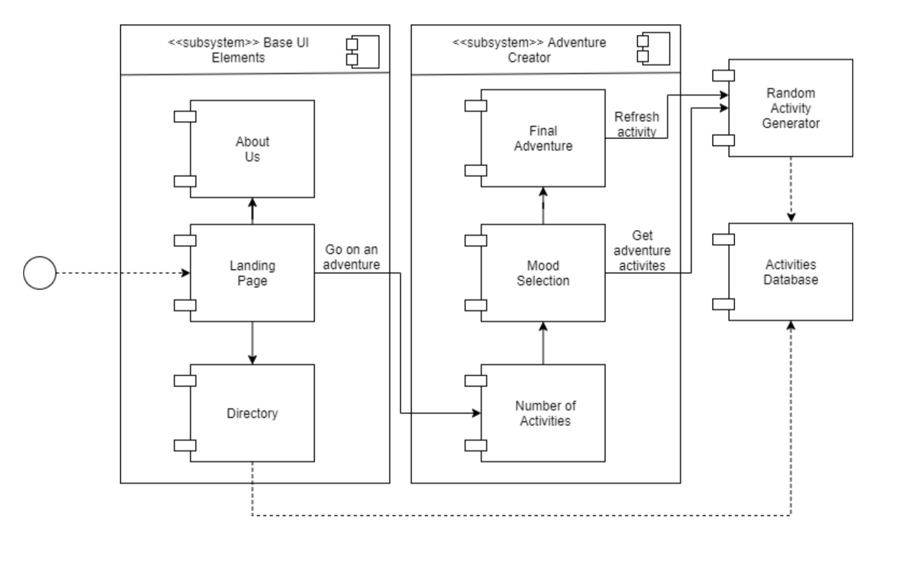

# System Diagram

# Business Model: Components (Client-Side) 
**Description:** An abstract layer that will be in the front of our database. It will enforce business rules about the data when we add new filters. 

* Local Business Data Retriever
  * **Responsability:** Handle the local business data requests from the website. It will communicate with the Local Business database.

* Random Activity Generator
  * **Responsability:** Choose a random activity from the category selected from the database.
  
# Business View Components (Client-Side)
**Description:** Front of the web application. It's where the user will interact with the application such as click and choose categories.
 
* Create your own adventure interface
  * **Responsability:** Walk the user through the steps to create an adventure.

* Select Amount of Activities
  * **Responsability:** Displays 3 cards with different types of stops. For each, shows the name which indicates the amount of stops, and a photo. 

* Mood Selector
  * **Responsability:** Displays 6 cards with all of the different types of business. For each, shows the name and picture that allows the user to create their adventure.
 
* Directory Page
  * **Responsability:** Get all of the businesses from the database and display them. Will be organized by category and have a preview of the business.
  
* Business Page
  * **Responsability:** Displays the information about the business. It shows the name of the business, phone number, street, Apt/Suite,city, state, zip code,
  short description, photo.

# Controller Components (Client-Side)
**Description:** We have pre-set HTML for each element of the adventure creator. Each adventure creation function will create a DOM element after each step of creating an adventure based on previously selected options.

* DOM Element Controller
  * **Responsability:** Each step of the adventure creation process has a DOM element controller that adds the HTML to the page using the information from the previous steps.

# Component Diagram

